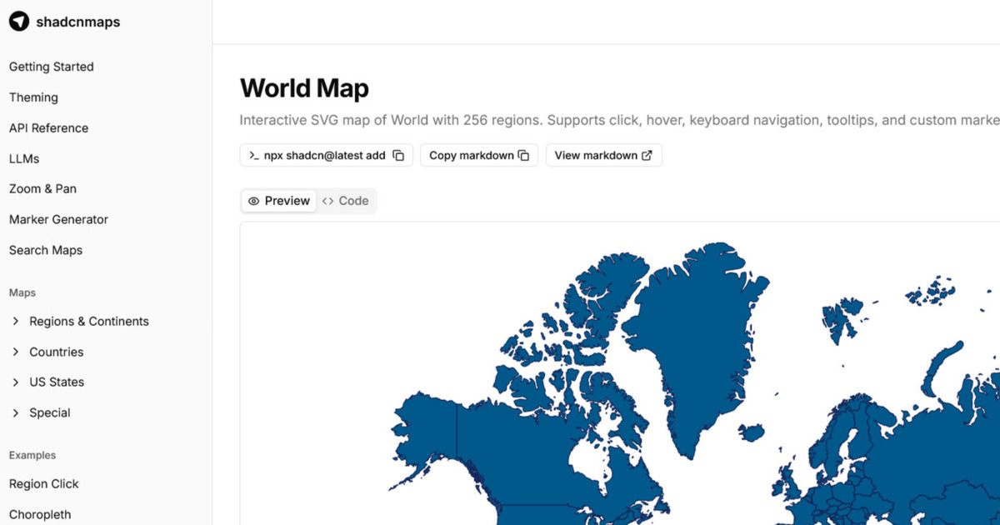

# shadcnmaps

170+ interactive SVG map components for React, built for the [shadcn/ui](https://ui.shadcn.com/) registry.

**No dependencies** — pure React SVG with Tailwind CSS styling. Install only the maps you need via the shadcn CLI.

- Countries, continents, and US states
- Click, hover, keyboard navigation, and tooltips
- Custom markers with SVG coordinates
- Zoom and pan controls
- Fully themeable with CSS variables
- Light and dark mode support

[Get started](https://shadcnmaps.com/overview/getting-started) | [Browse maps](https://shadcnmaps.com/maps) | [API reference](https://shadcnmaps.com/overview/api-reference)
